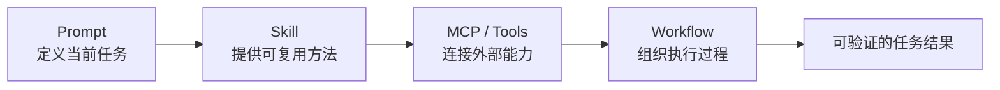
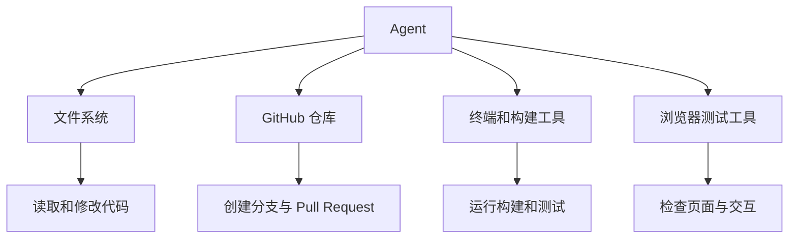
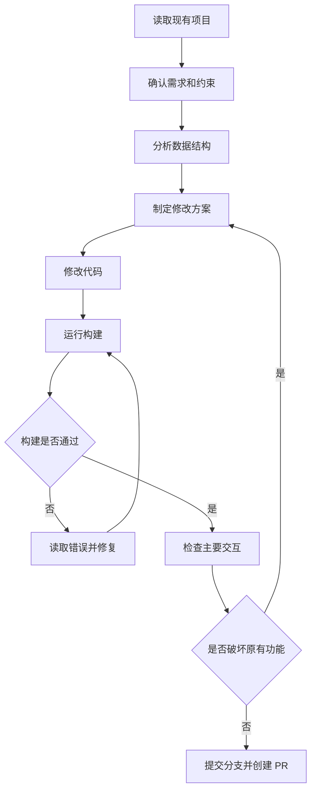
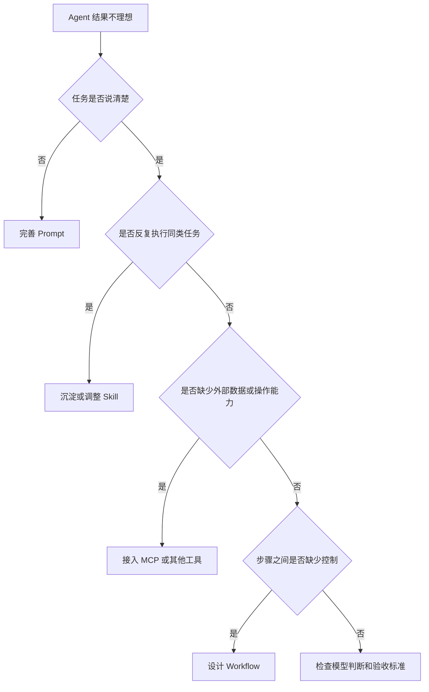

在讨论 AI Agent 时，Prompt、Skill、MCP 和 Workflow 经常会一起出现。

它们看起来都在做同一件事：扩展模型的能力，让 AI 可以完成更复杂的任务。于是很容易形成一种模糊的理解：Prompt 是给模型下指令，Skill 是一段更长、更专业的 Prompt，MCP 是给 Agent 安装工具，Workflow 则是把这些东西串联起来。

这种理解抓住了一部分现象，却没有真正区分它们解决的问题。

Prompt、Skill 和 MCP 并不是三种互相替代的技术，也不存在简单的高低之分。它们位于 Agent 系统的不同层级，各自填补不同的缺口。



可以先用一句话概括：

> Prompt 定义这一次要做什么，Skill 提供这类任务通常应该怎样做，MCP 负责连接外部数据和工具，Workflow 则把这些能力组织成一个可以执行的过程。

为了避免把文章写成概念词典，下面用一个具体任务贯穿全文：

> 使用 Agent 开发一个浏览器端 ToDo 小工具。

这个工具不需要后端服务器，数据保存在浏览器中，支持新增任务、完成任务、搜索、导入导出和到期提醒。同样是“让 AI 开发一个 ToDo 工具”，Prompt、Skill、MCP 和 Workflow 发挥的作用并不相同。

## Prompt：把当前任务说清楚

最简单的 Prompt 可能只有一句话：

> 开发一个 ToDo 工具。

模型当然可以根据这句话开始生成代码，但它不知道这个工具运行在哪里，不知道需不需要登录，也不知道任务数据应该保存到服务器、数据库，还是浏览器缓存中。

页面风格、技术方案、功能范围和交付形式，也都需要模型自行判断。最终得到的结果可能看起来像一个 ToDo 工具，却未必符合真正的使用需求。

一个更有效的 Prompt 可以是：

> 开发一个可以直接在浏览器中打开的 ToDo 小工具，使用原生 HTML、CSS 和 JavaScript，不依赖后端服务。任务数据保存在 localStorage 中，需要支持新增、编辑、删除、完成、搜索和 JSON 导入导出。界面适配桌面端和移动端，完成后检查主要交互是否正常。

这里并没有使用什么神奇的提示词技巧，只是补充了会影响技术决策的信息。

Prompt 解决的是当前任务中的沟通问题。它需要让模型知道目标、背景、限制、交付物和验收标准。重点不在于长度，而在于有效信息密度。

一段几百字的 Prompt，如果大部分内容只是在反复要求模型“认真思考”“扮演专家”“给出最佳答案”，提供的实际帮助可能十分有限。相反，一段不长的 Prompt，只要明确了运行环境、数据存储方式、功能范围和验收标准，通常就能显著减少模型的错误判断。

因此，Prompt 更像是一张针对当前任务的需求单。

它回答的是：

> 这一次，究竟要完成什么？

## Skill：把重复的方法沉淀下来

如果 ToDo 工具只开发一次，把全部要求写进 Prompt 并没有太大问题。但在真实开发中，许多要求并不只属于这一个项目。

例如，一个团队可能长期要求所有前端小工具使用语义化 HTML、适配移动端、校验导入数据、避免破坏现有功能，并在完成开发后执行构建和基础测试。代码还不能直接提交到主分支，而要通过功能分支和 Pull Request 交付。

如果每次开发小工具，都要重新把这些规则复制到 Prompt 中，内容会越来越长，也容易遗漏。

这些要求已经不是当前任务的临时信息，而是一套可以反复使用的工程方法。这正是 Skill 更适合解决的问题。

一个前端小工具开发 Skill，可能包含这样的结构：

```text
frontend-tool-skill/
├── SKILL.md
├── coding-guidelines.md
├── accessibility-checklist.md
├── testing-checklist.md
├── templates/
│   ├── index.html
│   └── README.md
└── scripts/
    └── validate-project.js
```

`SKILL.md` 描述执行这类任务时应遵循的整体方法，编码规范和检查清单保存稳定规则，模板提供基础项目结构，脚本则负责可自动化的校验。

这样一来，具体 Prompt 只需要描述当前项目的差异：这次开发的是一个 ToDo 工具，需要支持任务提醒和数据导入导出。至于前端项目怎样组织、如何检查可访问性、完成后验证哪些内容，可以由 Skill 提供。

Prompt 和 Skill 的边界由此变得清楚。

Prompt 保存的是本次任务的变量：

> 这次要做一个什么工具？

Skill 保存的是多次任务之间相对稳定的方法：

> 开发这一类工具时，通常应该遵循什么规则？

在实际使用 Agent 的过程中，我逐渐感觉到，Skill 的价值并不是让提示词变得更复杂，而是减少重复说明。一个方法只有在反复使用后仍然有效，才值得被沉淀成 Skill；否则，只是把临时要求换了一个地方保存。

还需要注意，“Skill”目前不是所有 AI 产品中含义完全一致的标准术语。有的平台把一组提示词称为 Skill，有的平台允许 Skill 同时包含文档、脚本、模板和工具，也有的平台实际上把预设工作流包装成 Skill。

所以判断一个 Skill 的能力时，不能只看名称，而要看它内部究竟封装了什么。

## MCP：让 Agent 能够接触真实世界

即使 Prompt 已经描述清楚，Skill 也提供了完整的开发规范，模型仍然可能停留在“给出建议”或“生成代码文本”的阶段。

例如，用户要求 Agent：

> 检查现有 ToDo 项目的代码，在不破坏已有功能的情况下增加任务提醒。

如果 Agent 无法读取项目仓库，它就不知道当前代码是什么样。如果它不能修改文件、运行项目和查看错误日志，也无法确认自己的修改是否真正生效。

这不是 Prompt 不够清楚，也不是 Skill 缺少方法，而是 Agent 缺少与外部系统的连接。

MCP，也就是 Model Context Protocol，可以理解为 AI 应用与外部数据、工具和系统之间的一种标准化连接方式。通过 MCP 或其他工具接口，Agent 可以获得读取文件、查询数据库、搜索网页、操作 GitHub、运行命令等能力。

在 ToDo 项目的场景中，Agent 可能需要连接这些外部能力：



这些能力让模型不再只是描述应该怎样修改，而是可以进入真实项目中执行操作。

但 MCP 本身不会告诉 Agent 应该开发什么，也不会自动提供一套高质量的开发方法。

一个 GitHub MCP Server 可以提供读取仓库、提交代码、创建分支和发起 Pull Request 的能力，但它不会自动知道任务数据应该保存在哪里、页面应该采用什么风格、哪些原有功能不能被破坏，也不知道修改完成后应该检查什么。

这些问题仍然需要由 Prompt、Skill、项目上下文和执行流程共同解决。

因此，MCP 更像一层能力接口。

它回答的是：

> Agent 可以访问什么，又可以实际操作什么？

如果把 Agent 看作一名刚加入项目的开发者，那么 Prompt 类似这次收到的需求，Skill 类似团队的开发手册和经验库，MCP 则类似代码仓库权限、终端权限和内部系统接口。

只有需求，没有仓库权限，开发者无法真正修改项目。只有权限，没有需求和规范，开发者也很容易把项目改乱。

## Workflow：把多个步骤组织起来

当 Prompt、Skill 和工具都准备好后，任务仍然不一定能够稳定完成。

因为开发一个 ToDo 工具并不是一次模型回答，而是多个前后关联的步骤。



这就是 Workflow 所关注的问题。

Workflow 不一定提供具体知识，也不一定直接连接外部工具。它主要定义任务的执行顺序和控制关系：必须先读取现有代码，才能决定如何修改；修改完成后必须运行构建；构建失败时不能继续提交；新功能正常后，还要检查原有功能；验证完成后才能创建 Pull Request。

如果缺少这些约束，Agent 很可能在修改完文件后就宣布任务完成。

但“文件已经修改”和“功能可以正常使用”显然不是同一件事。

Workflow 的价值，在于把原本依赖个人习惯的过程变成可重复执行的结构。当然，并不是所有步骤都适合写成固定流程。

构建是否通过，可以交给明确规则判断；页面风格是否自然、交互是否符合用户习惯，则可能需要模型结合上下文进行判断。

因此，实际的 Agent 系统通常会同时包含固定流程和动态决策：稳定、明确、风险较高的步骤由 Workflow 控制，需要理解语义和处理模糊信息的步骤由 Agent 判断。

Workflow 和 Agent 并不是互相替代的关系。Workflow 提供执行骨架，Agent 在骨架中处理无法提前写死的决策。

## 放回同一个 ToDo 项目中

把整个例子重新放在一起看，四个概念的边界会更加清晰。

| 概念 | 解决的问题 | 在 ToDo 项目中的作用 |
| --- | --- | --- |
| Prompt | 当前任务是什么 | 定义功能、技术栈、运行环境和验收要求 |
| Skill | 这类任务通常怎么做 | 提供开发规范、模板、检查清单和复用经验 |
| MCP | Agent 可以连接什么 | 连接文件、GitHub、终端和浏览器测试工具 |
| Workflow | 各个步骤如何协作 | 组织分析、修改、构建、测试和提交过程 |

它们并不是层层升级的关系。

写出更长的 Prompt，不能代替访问代码仓库的权限。接入 GitHub MCP，也不能代替清楚的项目需求。拥有完整的 Skill，如果没有真实工具，仍然只能给出修改建议。工具和规范都具备，如果缺少构建、测试和回归检查，Agent 依然可能交付一个无法正常使用的结果。

所以，面对一个效果不理想的 Agent，最有价值的问题不是“还应该安装哪个 Skill”，也不是“还要再接入哪个 MCP”，而是先判断问题到底出在哪一层。

## 任务失败时，应该检查哪一层

不同问题需要不同的解决方式。



如果 Agent 做出的产品和预期完全不同，问题可能在 Prompt。如果每次都需要重新解释相同的工程规范，问题可能在 Skill。如果模型只能告诉用户怎么改，却不能读取和修改真实项目，问题可能在工具或 MCP。如果模型改完代码就直接结束，没有构建、测试和回归检查，问题通常出在 Workflow 和验收标准。

这种分层判断比盲目增加工具更有效。

## 工具越多，不代表系统越强

MCP 和 Skill 很容易让人产生一种“安装得越多，Agent 越强”的错觉。

实际上，每增加一种能力，系统的复杂度也会随之增加。如果同时存在多个功能相似的工具，模型需要判断应该调用哪一个；如果工具描述不清楚，可能选择错误的参数；如果权限范围过大，一次错误操作造成的影响也会更严重。

Skill 也存在类似问题。多个 Skill 如果职责重叠，模型可能不知道应该加载哪一个；Skill 中保存的规则如果已经过时，反而会持续影响后续任务。

因此，一个 Agent 系统是否成熟，不能只看它接入了多少工具。更重要的是每个 Skill 是否有清楚的适用范围，每个工具是否有明确的能力边界，高风险操作是否需要确认，以及任务结果能否被验证。

一个只接入少量工具，但边界清楚、流程稳定、结果可验证的 Agent，通常比一个安装了几十个 MCP Server、却不知道什么时候应该调用什么的 Agent 更可靠。

## 真正重要的是判断缺少什么

Prompt、Skill、MCP 和 Workflow 会被放在一起讨论，是因为它们最终都会影响 Agent 的行为，但它们解决的是不同层面的问题。

Prompt 负责表达当前目标，Skill 负责沉淀重复使用的方法，MCP 负责连接数据、工具和外部系统，Workflow 负责组织多个步骤之间的关系。

可以把它们理解为：

> Prompt 定义目标，Skill 提供方法，MCP 提供能力，Workflow 组织过程。

但即使这四部分都已经具备，仍然缺少最后一个不能省略的环节：验证。

ToDo 工具能否正常运行，不能只看代码是否生成；新增提醒功能是否可用，需要实际触发；数据导入是否安全，需要测试异常文件；修改新功能后，还要确认原有任务管理功能没有被破坏。

Agent 的能力越强，验证就越重要。因为它不再只是生成一段文字，而是开始修改真实文件、操作真实系统，并影响实际结果。

对于 AI Agent 实践者来说，真正值得培养的能力，并不是记住所有新概念，也不是不断收集工具，而是在任务出现问题时，能够判断当前缺少的究竟是什么：任务没有表达清楚，方法没有沉淀，外部能力没有接通，还是执行过程没有被合理组织。

当这些边界逐渐清楚以后，Agent 才不再只是一个装了很多工具的聊天机器人，而开始成为一个可以稳定参与实际工作的系统。
